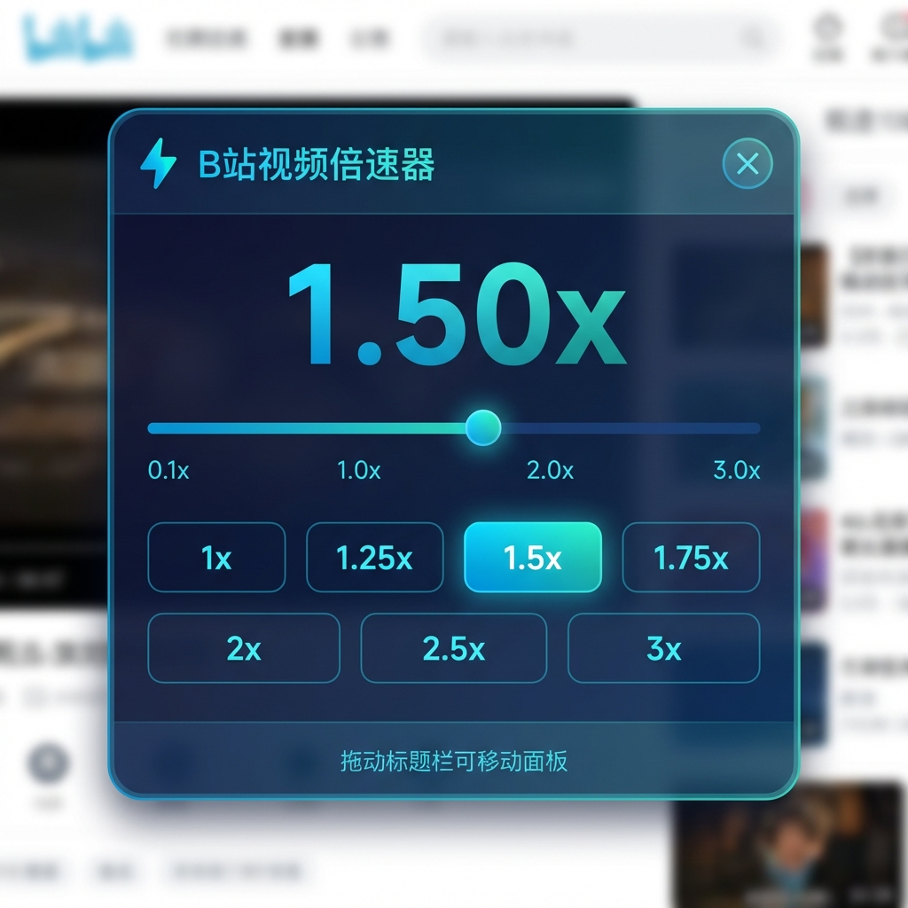

# B站视频倍速控制器

  

这是针对 Bilibili 的视频倍速控制器油猴（Tampermonkey/Greasemonkey）脚本。

## 📸 预览

## 📦 安装方法

### 方法一：GreasyFork 安装（推荐）
1. 确保已安装 [Tampermonkey](https://www.tampermonkey.net/) 或 [Greasemonkey](https://www.greasespot.net/)
2. 访问 **[GreasyFork 脚本页面](https://greasyfork.org/zh-CN/scripts/561015-b%E7%AB%99%E8%A7%86%E9%A2%91%E5%80%8D%E9%80%9F%E5%99%A8)**
3. 点击绿色的「安装此脚本」按钮

### 方法二：手动安装
1. 打开 Tampermonkey 管理面板
2. 点击「新建脚本」
3. 将 `bilibili-speed-controller.user.js` 的内容复制粘贴进去
4. 保存（Ctrl+S / Cmd+S）

## ✨ 功能特性

- 🎬 **专为 B站 优化** - 深度适配 B站 播放器
- 💾 **记住设置** - 速度设置会自动保存
- 🔄 **自动应用** - 打开视频自动设置为默认倍速
- 🖱️ **手动倍速检测** - 检测到用户手动调速后暂停自动应用
- 🎛️ **悬浮设置面板** - 美观的设置面板，支持滑杆调节和快捷按钮
- 🧠 **位置记忆** - 设置面板位置会自动保存

## 🔧 使用方法

### 油猴菜单
在 Bilibili 视频页面，点击油猴图标，可以看到以下菜单选项：

| 菜单项 | 说明 |
|--------|------|
| 📊 当前状态 | 查看当前速度和视频检测情况 |
| ⚡ 启用/禁用 | 切换倍速功能开关 |
| ⚙️ 打开设置面板 | 打开悬浮设置面板 |

### 设置面板功能
- **滑杆调节** - 拖动滑杆精确调节速度（0.1x - 3.0x）
- **快捷按钮** - 一键设置常用速度
- **拖动移动** - 拖动标题栏可移动面板位置
- **ESC 关闭** - 按 ESC 键或点击遮罩关闭面板

## ⚙️ 默认设置

- **默认速度**: 1.5x

## 📝 更新日志

### v1.2.0 (2026-01-09)
- 新增悬浮设置面板，支持滑杆调节速度
- 精简油猴菜单（从 10 项减少为 3 项）
- 添加快捷按钮和面板拖动功能
- 支持面板位置记忆

### v1.1.1 (2026-01-01)
- 重命名脚本为 `bilibili-speed-controller.user.js`
- 独立为 Bilibili 专用仓库

### v1.1.0 (2026-01-01)
- 精简脚本，变为 Bilibili 专版
- 移除其他平台相关代码
- 将预设倍速常量移至脚本顶部，方便修改
- 更新默认倍速为 1.5x

### v1.0.0 (2025-12-30)
- 从 Chrome 插件迁移为油猴脚本
- 保留所有核心功能
- 使用 GM_getValue/GM_setValue 替代 chrome.storage
- 使用 GM_registerMenuCommand 提供设置界面

## 🔗 相关链接

- [问题反馈](https://github.com/codertesla/bilibili-video-speed-controller-userscript/issues)

## 📄 许可证

MIT License
